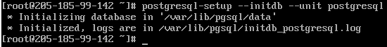
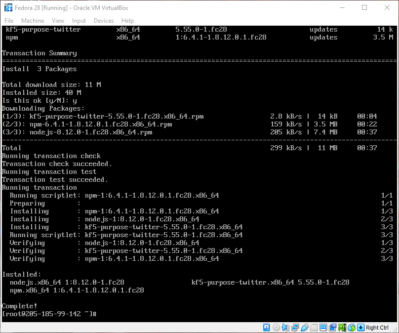
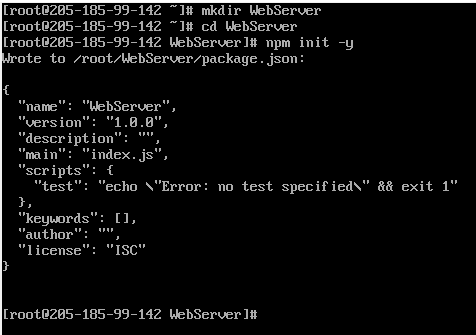
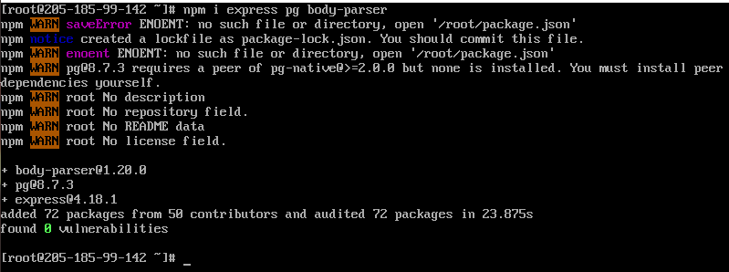
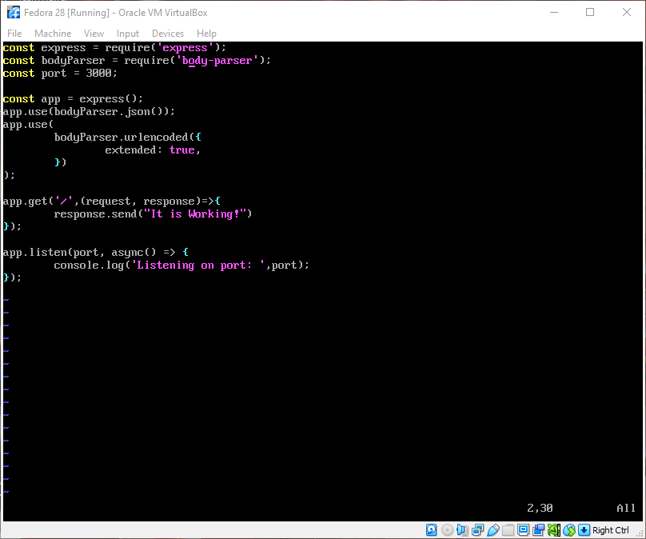
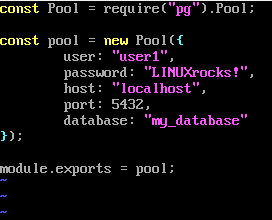
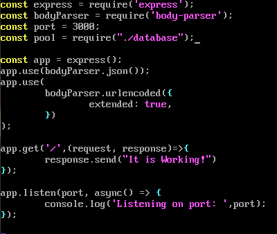
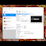

# Setting up a PERN Stack on Fedora Linux

---

Make sure that you have administrator priviledges in your machine. If you do not have that access use "sudo" in front of these commands.

---

## Part 1: Installations

### PostgreSQL Installation/Initial Database Setup

---

Follow these instructions in the command line of your fedora Linux machine:

---

Step 1: Install PostgreSQL Using dnf and Enter "Y" when Prompted
```
dnf install postgresql-server
```


Step 2: Set PostgreSQL to Start at Boot Time
```
systmectl enable postgresql
```


Step 3: Initialize the Database
```
postgresql-setup --initdb --unit postgresql
```


Step 4: Reboot System or Start PostgreSQL Manually Using:
```
systemctl start postgresql
```

Step 5: Create a PostgreSQL User and Database
```
sudo -u postgres psql
```
After running the command above, you are in the postgresql command prompt. You can create a user and database from here with these commands:
```
CREATE USER <username> WITH PASSWORD '<password>';
CREATE DATABASE <databaseName> OWNER <username>;
```

---

Remember your username, password and databaseName for your database, they are important and will be used later in this turtorial.

Use "\du" to list all roles and "\list" to list all databases to make sure that your database and user were added.
```
\du
\list
```

---

Step 6: Exit the Terminal
```
\q
```
OR Ctrl + D


You can now access you user's database at any time with this command:
```
psql <databaseName>
```


### Node.js Installation

---

Follow these instructions in the command line of your fedora Linux machine:

---

Step 1: Install Node.js Using dnf and Enter "Y" when Prompted
```
dnf install nodejs
```



## Part 2: Node.js Server Setup

### Express Installation/Web Server Setup

---

Follow these insctructions in the command line of your Fedora Linux machine to install and set up a basic web server using express:

---

Step 1: Create and Move Into a Directory for your project
```
mkdir <projectname>
cd <projectname>
```

Step 2: Create a package.json file.
```
npm init -y
```



Step 3: Install Express, PG, and Cors using npm
```
npm i express pg body-parser
```


Step 4: Create a js file and add code. In this turtorial, I will be using vim, but use whatever text editing software you are comfortable with.
```
vim index.js
```
You will use the express module and also the body-parser module. You also want to set your port variable so that you know where to look for your web server. Now copy the code below into your index.js file.
```
const express = require('express');
const bodyParser = require('body-parser');
const port = 3000;

const app = express();
app.use(bodyParser.json());
app.use(
  bodyParser.urlencoded({
    extended: true,
  })
);
```

Step 5: Create a GET request. You will want to add this code block to your index.js file so that you tell a route to look for a get request and return the information you give it so that you can see that the web page is working.
```
app.get('/',(request, response)=>{
  response.send("It is working!")
});
```

Step 6: Have set express to listen to the port that you set in the beginning of the file.
```
app.listen(port, async() => {
  console.log('Listening on port: ',port);
});
```
Finally, save and quit your index.js file. In normal mode, type ":wq" and hit enter to save any changes and quit the text editor.



Step 7: Now that you have saved the index.js file you can run the server with the command:
```
node index.js
```
The output should look like this:


Step 8: Open your browser and in the search bar type "http://localhost:3000" and hit enter. This is what you should see in you browser:


If this is what you see, congratulations! You have made a simple web server using express and node.js! Stop your server by going to your terminal where your server is running and pressing "Ctrl + C".


### Setting up your Node.js Server to Start on Boot

---

Follow these insctructions in the command line of your Fedora Linux machine to start your server that you have just created on boot time:

---

Step 1: Add "node index.js" command to Crontab. Start by using the
```
crontab -e
```
command and select a text editor if you haven't already edited your crontab file. Once you have selected an editor add this new line in your crontab file.
```
@reboot node <index.jsFullPath> &
```
It will look like this.


Save and quit your text editor

## Part 3: Connecting Postgres Database

### Connecting the Postgresql Database to Our Node.js Server

---

Follow these insctructions in the command line of your Fedora Linux machine to connect our postgres database to our node.js server so that we can access our database in our server:

---

Step 1: In the project directory you created, create a file called database.js. This file will set all the rules that we will use to connect to our database from our server.
```
vim database.js
```
In our database.js file, you want to add these lines of code. You will need your database information from earlier in this turtorial.
```
const Pool = require("pg").Pool;

const pool = new Pool({
    user: "<databaseUsername>",
    password: "<databasePassword>",
    host: "localhost",
    port: 5432,
    database: "<databseName>"
});

module.exports = pool;
```
The code above requires the pg library to make connecting to your server easy. You create a new Pool with your database information in it, including the host, and port the database will run on. You export the module "pool" so that it is accessible to other js files.

Save and quit your database.js file.



Step 2: Add the Import the pool Module in your index.js file. Open your index.js file and add this code after your port constant.
```
const pool = require("./database");
```



Congratulations! You have officially connected your database to your node.js server.


## Part 4: Accessing Database Through Your Server

This is just a breif explanation on how to use the connection to your database.

There are many ways to go back and forth to your database, but in order to access for create any data, you will need a "app.post()" line in your index.js. You also would need to create tables for your need in the postgresql command line.

An example of this could be if you wanted to insert user information from a local json file on your web server at the "http://localhost:3000/signup" url.

Your new lines in your index.js filw would look something like this:
```
app.post('/signup', async (request, response) => {
    const { userName } = request.body;
    const newUsername = await pool.query("INSERT INTO userInfo (userName) VALUES($1)", [userName]);
    res.json(newUsername);
});
```

Your json file with the user information would look something like this:
```
{
    "userName": "user2"
}
```

Now all you would need to do is write a curl script and run it with the appropriate url and json file. It might look something like this:
```
curl -d "@data.json" -X POST -H "Content-Type:application/json" http://localhost:3000/signup
```

When you run your curl script, the username "user2" should be added to your userInfo table.

---

This is just a small add-on to this turtorial, but there are many other turtorials that will show you how to correctly add routes between your server and database, so that you can query your database.

---

## Video of Fedora Linux Virtual Machine Testing Server Startup


